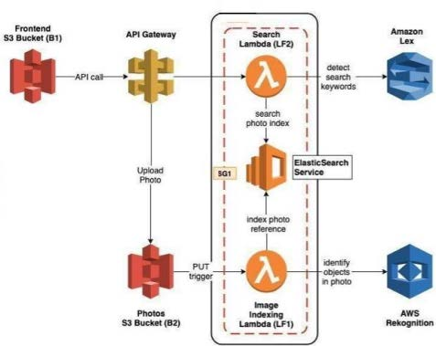

# SnapSense - Photo Album Application with Intelligent Search

This project implements a serverless **photo album web application** with natural language search capabilities using AWS services like **Lex**, **Rekognition**, **Elasticsearch**, and **S3**. The application allows users to upload, search, and retrieve photos based on detected and custom labels.

---

## Key Features

1. **Upload Photos**:
   - Users upload photos to an **S3 bucket** with optional custom labels.
   - AWS Rekognition automatically detects objects, actions, or landmarks in the photos.
   - A **Lambda function** indexes the photo and its labels into an **Elasticsearch** index.

2. **Natural Language Search**:
   - Users can search for photos using natural language queries like:
     - "Show me cats"
     - "Show me photos with dogs and trees"
   - An **Amazon Lex Bot** disambiguates the query to extract keywords.
   - A second **Lambda function** searches the **Elasticsearch index** for relevant results.

3. **Custom Labels**:
   - Custom labels provided during upload are stored as metadata in S3.
   - These custom labels are indexed along with Rekognition-detected labels.

4. **API Layer**:
   - **Amazon API Gateway**:
     - `PUT /photos`: Proxy to S3 for uploading photos.
     - `GET /search?q=<query>`: Connects to the search Lambda function.

5. **Frontend Application**:
   - Simple user interface for:
     - Uploading photos with custom labels.
     - Searching and displaying photos.
   - Hosted on an **S3 bucket** with static website hosting.

6. **Deployment Automation**:
   - **AWS CodePipeline** automates deployment for backend (Lambdas) and frontend (S3 bucket).

7. **CloudFormation Template**:
   - A basic CloudFormation template is provided to spin up key resources:
     - S3 buckets, Lambda functions, and API Gateway.

---

## Architecture Diagram

---

## Workflow

1. **Upload**:
   - Photo uploaded → S3 PUT event triggers indexing Lambda → Rekognition detects labels → Data indexed in Elasticsearch.

2. **Search**:
   - User query → Lex Bot extracts keywords → Lambda searches Elasticsearch → Results returned to frontend.

3. **Custom Labels**:
   - Added during upload and indexed alongside detected labels.

---

## Technologies Used

- **AWS Services**: S3, Lambda, API Gateway, Rekognition, Elasticsearch, Lex, CodePipeline, CloudFormation.
- **Frontend**: Static website hosted on S3.
- **CI/CD**: Automated deployments via CodePipeline.
- **Search**: Elasticsearch and Lex for search and disambiguation.

---

## How to Run

1. **Deploy the CloudFormation Template**:
   - Provision S3 buckets, Lambdas, and API Gateway.
2. **Deploy Frontend**:
   - Upload the frontend code to the S3 bucket.
   - Access the hosted URL.
3. **Use the Application**:
   - Upload photos, search with natural language, and view results.

---

## Future Enhancements

- Add support for advanced search filters and pagination.
- Integrate authentication for user management.
- Enable real-time photo analytics and dashboards. 
